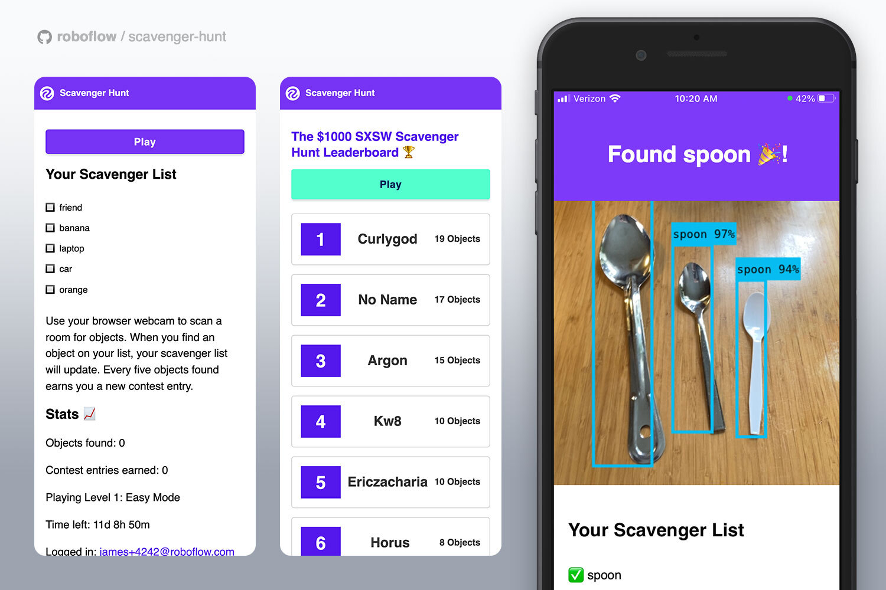

<div align="center">
    <a href="https://youtube.com/roboflow">
        
    </a>
    
    <a href="https://roboflow.com">
        
    </a>
    
    <a href="https://www.linkedin.com/company/roboflow-ai/">
        
    </a>
    
    <a href="https://docs.roboflow.com">
        
    </a>
    
    <a href="https://disuss.roboflow.com">
        
    
    <a href="https://blog.roboflow.com">
        
    </a>
    </a>
</div>

# SXSW + Roboflow Scavenger Hunt

This repository contains the code for the scavenger hunt run by Roboflow in celebration of SXSW 2023.

In this scavenger hunt, event participants are tasked with identifying five objects from the Microsoft COCO dataset. After identifying five objects, players are prompted with five more to identify. For every five objects identified, players are given an additional ticket to enter a contest to win $1,000.

This repository contains the source code for the application.

You can use your own model hosted on Roboflow with this application.



## Technologies Used

- [Supabase](https://supabase.io)
- [Node.js](https://nodejs.org/en/)
- [Express.js](https://expressjs.com/)
- [roboflow.js](https://docs.roboflow.com/inference/web-browser)

## Getting Started

To get started, you will need a Supabase account with three tables. The schema for these tables is in the `schema.sql` file in this repository. This schema file was generated using the following command:

```
pg_dump -h SUPABASE_DATABASE_URL -U postgres --data-only -n public -n auth > supabase_data.sql
```

You can ingest it into your Supabase project using the following command:

```
psql -f schema.sql -p PORT -U USERNAME DATABASE_NAME -h SUPABASE_DATABASE_URL
```

When you have the requisite tables, export the URL and key for your Supabase project as environment variables, as well as the port on which you want the application to run.

```
export SUPABASE_URL=""
export SUPABASE_KEY=""
export PORT=8080
```

Then, install the required dependencies:

```
npm install
```

Finally, run the application using Node:

```
node app.js
```

## Use Your Own Model

To use your own model, you will need:

1. Your Roboflow API key.
2. Your model ID.
3. Your model version number.
4. A list of the classes in your project.

Follow our [API key guide to find your API key](https://docs.roboflow.com/rest-api#obtaining-your-api-key) in the Roboflow dashboard.

To retrieve your model ID and version number, go to the Versions page associated with your project in the Roboflow dashboard. Copy the string below "Training Results", highlighted here:


Your model version number is the number next to the model ID.

To retrieve a list of classes in your project, go to the Health Check tab and copy all of the label names in the Class Balance section.

Next, open up `public/script.js` and replace the values of these variables:

1. `current_model_name` with your model ID.
2. `current_model_version` with your model version number.
3. `API_KEY` with your Roboflow API key.

Open the `classes.json` file and replace the class names with the names of classes in your dataset. The names in this file _must_ be an exact match to the class names returned by the model.

The `classes.json` file has three tiers: 1, 2, and 3. This mechanic allows you to implement levels of difficulty. The easiest classes to identify should go in Tier 1; the hardest classes to identify should go in Tier 3. In the game, classes will be assigned in order of tiers. When Tier 1 is exhausted, Tier 2 classes are assigned, and so on.

## License

This project is licensed under an [MIT license](LICENSE).